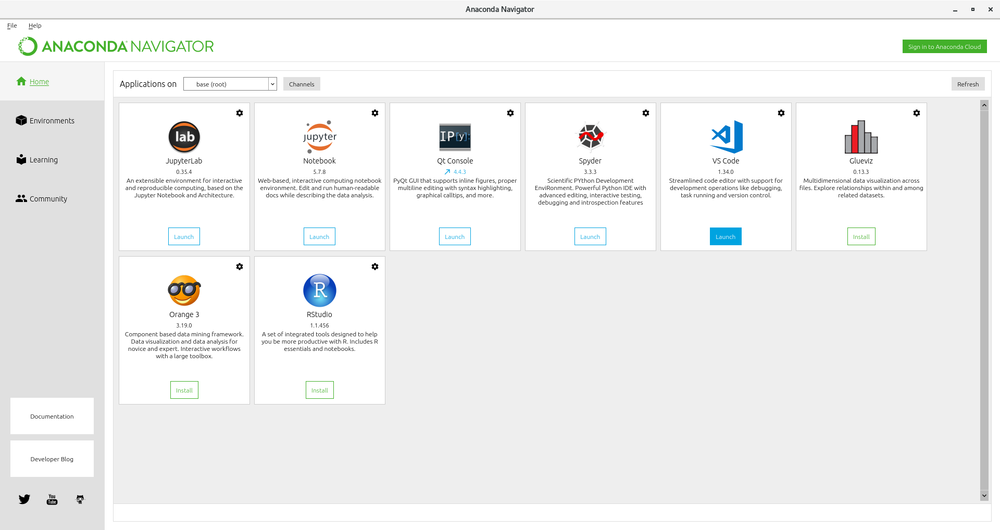

# setup-new-centos


## Install Latest Version of Git From IUS Repository

* Install git
```
sudo yum -y install  https://centos7.iuscommunity.org/ius-release.rpm
sudo yum -y install  git2u-all

$ git --version
git version 2.16.5
$ 

```

* Setup
```
mkdir .ssh

$ ll /run/media/$(whoami)/E_4G_02/Backup/id_rsa*
-rw-r--r--. 1 python python 1679 Feb 15 11:40 /run/media/python/E_4G_02/Backup/id_rsa
-rw-r--r--. 1 python python  405 Feb 15 11:58 /run/media/python/E_4G_02/Backup/id_rsa.pub
$ 

sudo cp /run/media/$(whoami)/E_4G_02/Backup/id_rsa* .ssh/
sudo chown $(whoami). .ssh/id_rsa*
sudo chmod go-r .ssh/id_rsa*

$ ll .ssh/
total 8
-rw-------. 1 python python 1679 Jun  8 18:33 id_rsa
-rw-------. 1 python python  405 Jun  8 18:33 id_rsa.pub
$ 

git config --global user.name "xxxx xx"
git config --global user.email xxxxx@xxxxx.com

$ git config --global --list
user.name=xxxx xx
user.email=xxxx@xxxxx.com
$ 

```


## Install Latest Version of Python

* Download Anaconda package and install

```
curl -O https://repo.anaconda.com/archive/Anaconda3-2019.03-Linux-x86_64.sh 
mv Anaconda3-2019.03-Linux-x86_64.sh Downloads/ 

$ bash Downloads/Anaconda3-2019.03-Linux-x86_64.sh  

... 

==> For changes to take effect, close and re-open your current shell. <== 
 
If you'd prefer that conda's base environment not be activated on startup,  
   set the auto_activate_base parameter to false:  
 
conda config --set auto_activate_base false 
 
Thank you for installing Anaconda3! 
 
=========================================================================== 
 
Anaconda and JetBrains are working together to bring you Anaconda-powered 
environments tightly integrated in the PyCharm IDE. 
 
PyCharm for Anaconda is available at: 
https://www.anaconda.com/pycharm 
$
```

* Exit and launch command terminal 

```
$ python --version
Python 3.7.3
$ 
```

* Update installation

```
conda update conda
conda update anaconda
```

* Launch ANACONDA NAVIGATOR

```
$ anaconda-navigator 
WARNING: The conda.compat module is deprecated and will be removed in a future release.
/home/python/anaconda3/lib/python3.7/site-packages/anaconda_navigator/api/conda_api.py:1364: YAMLLoadWarning: calling yaml.load() without Loader=... is deprecated, as the default Loader is unsafe. Please read https://msg.pyyaml.org/load for full details.
  data = yaml.load(f)
2019-06-08 18:22:01,118 - ERROR download_api._download:234
Invalid url https://www.anaconda.com/wp-content/uploads/Screen-Shot-2018-07-16-at-10.21.36-AM.png

2019-06-08 18:22:04,087 - ERROR download_api._download:234
Invalid url https://www.anaconda.com/wp-content/uploads/2018/05/Screen-Shot-2018-05-23-at-5.52.25-PM.png

```




## Install AWS cli

* Upgrade pip if applicable

```
$ python --version
Python 3.7.3
$ pip --version
pip 19.0.3 from /home/python/anaconda3/lib/python3.7/site-packages/pip (python 3.7)
$ 

pip install --upgrade pip

$ pip --version
pip 19.1.1 from /home/python/anaconda3/lib/python3.7/site-packages/pip (python 3.7)
$ 
```

* Install and configure awscli 
```
pip install awscli --upgrade --user

$ aws --version
aws-cli/1.16.174 Python/3.7.3 Linux/3.10.0-957.12.2.el7.x86_64 botocore/1.12.164
$ 

$ aws configure --profile prod
AWS Access Key ID [None]: 0kUwX0h7WPwOPU6KGl4X
AWS Secret Access Key [None]: yelOsXNYs13pn9sC6bst7tKD8jkK4ne2q8K9ojQr
Default region name [None]: ap-southeast-2
Default output format [None]: 
$  

```

* Test

```
$ aws ec2 describe-key-pairs --profile prod
{
    "KeyPairs": [
        {
            "KeyFingerprint": "43:51:43:a1:b5:fc:8b:b7:0a:3a:a9:b1:0f:66:73:a8:f0:62:5a:b8",
            "KeyName": "first t2"
        },
        {
            "KeyFingerprint": "12:f8:7e:78:61:b4:bf:e2:de:24:15:96:4e:d4:72:53:f0:62:5a:b8",
            "KeyName": "nessus"
        }
    ]
}
$ 

```

